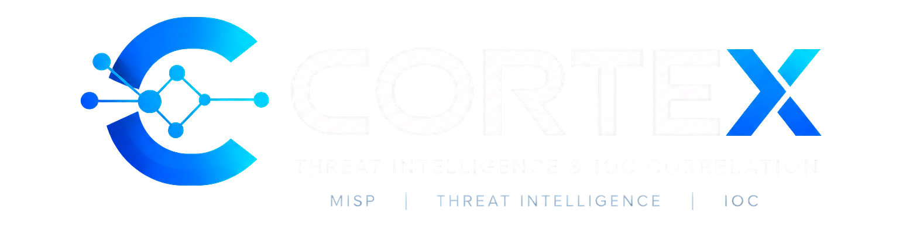

<p align="center">
<a href="https://pypi.org/project/cortex-tip/">

# Cortex TIP — Threat Intelligence & SOC Platform

<p align="center">
  <strong>Plataforma para Gestão de Threat Intelligence, Enriquecimento de IOCs e Apoio a Operações de SOC com IA Local.</strong>
</p>

<p align="center">
  <a href="https://pypi.org/project/cortex-tip/"></a>
  <a href="https://python.org/"></a>
  <a href="https://mariadb.org/"></a>
  <a href="https://www.docker.com/"></a>
</p>

---

## 🧭 Visão Geral

O **Cortex TIP** é uma plataforma de **Threat Intelligence Platform (TIP)** projetada para elevar a maturidade operacional de equipes de **SOC (Security Operations Center)** e analistas de Inteligência de Ameaças.

Ele atua como o cérebro central de inteligência da sua infraestrutura de segurança: conecta-se a instâncias do **MISP**, executa enriquecimento reputacional multi-fonte em tempo real, correlaciona ameaças em grafos interativos e conta com um **Analista SOC com Inteligência Artificial Local (Ollama: DeepSeek-R1 / Qwen)** que avalia riscos, expõe o raciocínio investigativo (*Chain-of-Thought*) e sugere comandos imediatos de mitigação para Firewalls e EDRs.

---

## ⚡ Instalação (Get Started)

Instale globalmente no seu sistema operacional via **pipx** (recomendado):

```bash
pipx install cortex-tip
```

Ou com **uv**:

```bash
uv tool install cortex-tip
```

Ou diretamente com **pip**:

```bash
pip install cortex-tip
```

---

## 🚀 Inicialização Rápida

Com o Docker ativo na máquina, basta digitar no terminal:

```bash
cortex-tip
```

O comando baixa e inicializa automaticamente a stack completa:
- 🗄️ **MariaDB 11.4 LTS** isolado com volume persistente de dados.
- ⚡ **Cortex TIP Web App** pré-compilado e pronto na porta **`80`**.

Acesse o painel no navegador: **`http://localhost:80`**

### Comandos de Gerenciamento da CLI:

| Comando | Descrição |
| :--- | :--- |
| `cortex-tip` ou `cortex-tip start` | Inicia a plataforma completa (Banco MariaDB + Interface Web) |
| `cortex-tip status` | Exibe o estado de execução e integridade dos contêineres |
| `cortex-tip logs` | Acompanha os logs operacionais e de eventos em tempo real |
| `cortex-tip update` | Atualiza automaticamente para a última imagem do Docker Hub |
| `cortex-tip stop` | Pausa os serviços mantendo todos os dados e volumes salvos |
| `cortex-tip db:up` | Sobe exclusivamente o contêiner do MariaDB na porta `3306` |

---

## 🚀 Principais Capacidades da Plataforma

### 1. Integração Híbrida com o MISP
- **Sincronização Contínua em Alta Velocidade:** Leitura direta de tabelas MySQL do MISP para atualização de milhares de atributos sem gargalos de API.
- **Ingestão Oficial de IOCs (PyMISP):** Formulário completo para cadastrar novos eventos e atributos com categorias oficiais (*Network activity*, *Payload delivery*, *Antivirus detection*, etc.) e integridade referencial preservada.

### 2. Enriquecimento Multi-Origem em Tempo Real
Ao consultar qualquer indicador de comprometimento (IP, Domínio, Hash SHA256/MD5 ou URL), o Cortex realiza o cruzamento instantâneo com:
- **VirusTotal (v3):** Taxa de motores maliciosos, reputação comunitária e tags de ameaça.
- **AbuseIPDB (v2):** *Abuse Confidence Score*, volume de denúncias recentes e ISP.
- **Geolocalização & Infraestrutura:** País de origem, Cidade, ASN corporativo e mini-mapa interativo.
- **MITRE ATT&CK Matrix:** Identificação e mapeamento de Táticas e IDs de técnicas adversárias associadas (ex: `T1071`, `T1566`).

### 3. Copiloto Analista SOC com IA Local (Ollama)
- Suporte a modelos de raciocínio profundo locais via Ollama (**DeepSeek-R1**, **Qwen2.5-Coder**) ou em nuvem (Gemini, OpenAI, Anthropic).
- **Veredito de Risco Automatizado:** Síntese executiva com classificação de severidade e contexto do ataque.
- **Visualização do Chain-of-Thought:** Analistas podem inspecionar as etapas de dedução lógica e raciocínio técnico da IA.
- **Comandos Prontos de Mitigação:** A IA gera regras e comandos de bloqueio sob medida (ex: *iptables*, *Palo Alto*, *Fortinet*, *Windows Defender Firewall*, regras de EDR).

### 4. Grafo de Correlação Interativo
- Alternância em tempo real entre visão tabular clássica e **Grafo de Correlação Neural**.
- Mapeia conexões visuais entre o IOC investigado, eventos correlacionados no MISP, tags do MITRE ATT&CK e infraestrutura de rede externa.

### 5. Dashboard Operacional SOC
- **Mapa Mundi de Ameaças:** Visualização geográfica com hotspots e círculos de concentração de incidentes.
- **Cyber News Feed:** Notícias mais recentes do cenário global de ameaças (*The Hacker News*, *BleepingComputer*).
- **Catálogo CISA KEV (Zero-Days):** Feed automatizado com vulnerabilidades exploradas ativamente no mundo selvagem.

### 6. Controle de Acesso e Governança (RBAC)
- **Wizard de Primeiro Acesso:** Provisionamento guiado do primeiro Super Administrador do sistema.
- **Perfis Delimitados:**
  - **Admin:** Controle irrestrito de usuários, configurações de IA, integrações e dados.
  - **Analista:** Ingestão de ameaças no MISP, enriquecimento, consultas e visualização de auditoria.
  - **Visualizador:** Acesso de somente leitura para dashboards e monitoramento.
- **Trilha de Auditoria:** Registro detalhado de quem cadastrou cada indicador, timestamp e ID de evento.

### 7. Exportação e Feeds para Firewalls
- Endpoints de exportação formatados para consumo por firewalls, proxies, SIEMs e regras de SIEM/EDR:
  - `/misp_ips.json`
  - `/misp_domains.json`
  - `/misp_urls.json`
  - `/misp_filehashs.json`

---

## 🏗️ Arquitetura do Sistema

```text
               ┌────────────────────────┐
               │    Navegador do SOC    │
               └───────────┬────────────┘
                           │ HTTP: 80
                           ▼
┌─────────────────────────────────────────────────────────┐
│              CORTEX TIP DOCKER ENVIRONMENT              │
│                                                         │
│  ┌───────────────────────┐   ┌───────────────────────┐  │
│  │   cortex-app (Flask)  │   │     cortex-mariadb    │  │
│  │   - Motor de IA / SOC │◄──┤   (MariaDB 11.4 LTS)  │  │
│  │   - Enriquecimento    │   │   - Volume Persistente│  │
│  └───────────┬───────────┘   └───────────────────────┘  │
└──────────────┼──────────────────────────────────────────┘
               │
               ├──► Instância MISP (API REST / MySQL)
               ├──► APIs de Inteligência (VirusTotal / AbuseIPDB)
               └──► Servidor Ollama Local (DeepSeek-R1 / Qwen)
```

---

## 📄 Licença

Distribuído sob a licença **MIT**. Veja o arquivo `LICENSE` para mais detalhes.
